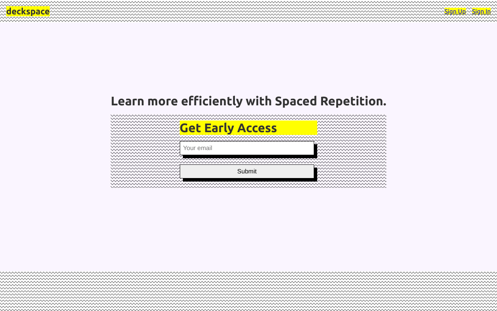
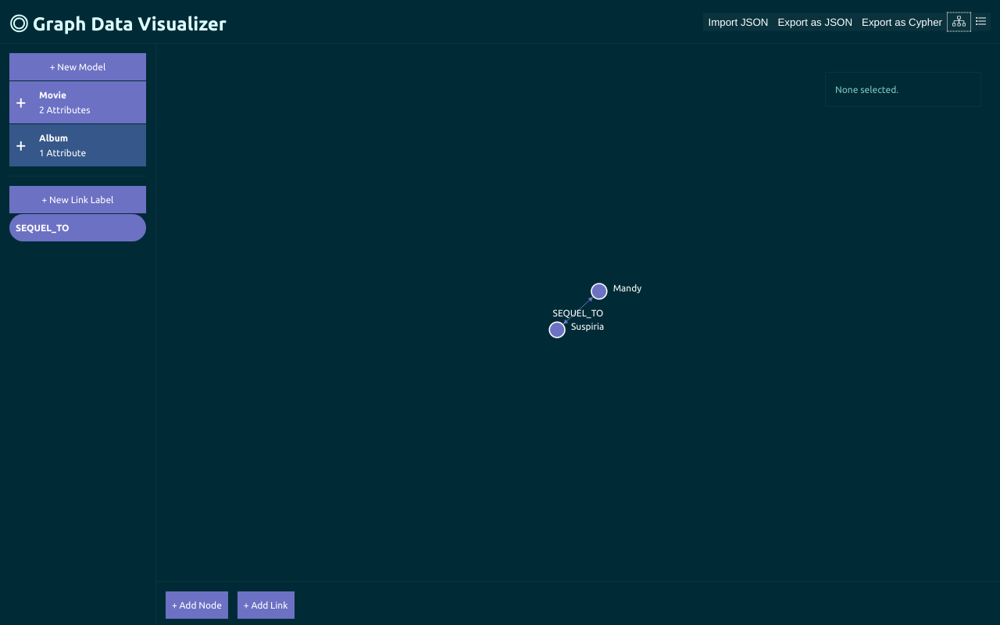

I am a full-stack web developer and team lead at <a href="https://clickherelabs.com">Click Here Labs</a>, where my primary focus is on the development of web-based applications.

If you check out the <a href="/posts/">blog section</a>, you will see some of the technologies I am interested in, which include (but are not limited to!) JavaScript, React, Vue, Next.js, Vercel, FaunaDB, GraphQL, Ruby, and Rails. I'm currently dipping my toes into TypeScript, and liking what I'm seeing/hearing.

I take a consultative approach to the projects that I am involved with. Usually this means working across disciplines to help each understand the needs of the other, identifying and addressing pain points in the product development process, and implementing best practices along the way.

The end goal is to produce meaningful software that empowers people to achieve their personal and professional goals &ndash; and to have a good time doing it.

## Selected Projects

<a href="https://deckspace.app" style="width: 48%;margin-right:3%;display:inline-block;">deckspace

</a>
<a href="https://graph.jamespierce.dev" style="width: 48%;display:inline-block;">Graph Data Visualizer

</a>
